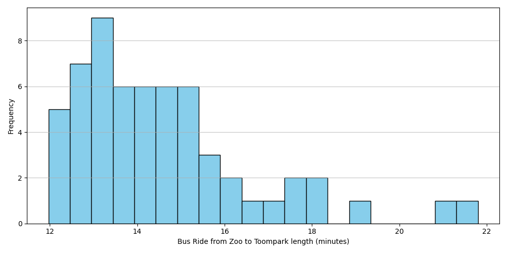
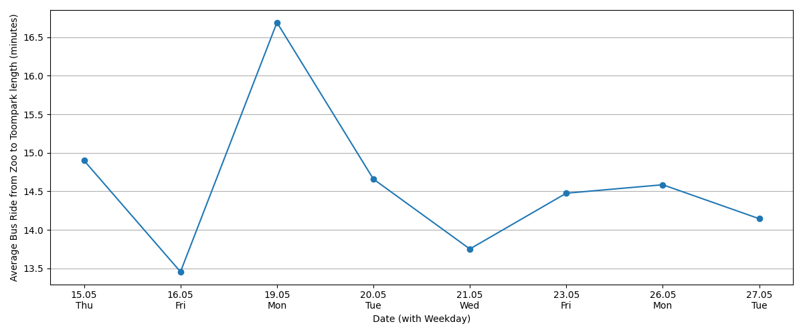
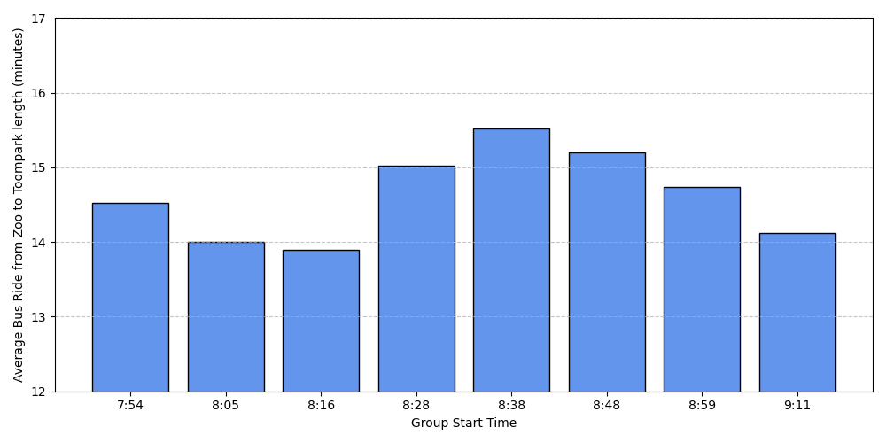

# RMK Internship Challenge 2025

This project is made for the RMK data team internship test challenge.  
The goal is to find out how likely it is that Rita will be late to her 9:05 AM meeting, depending on when she leaves home.

Rita takes Tallinn city bus number 8 from the Zoo stop to Toompark.  
She needs:
- 5 minutes to walk from home to the Zoo stop
- 4 minutes to walk from Toompark to her meeting room

So, the bus needs to arrive at Toompark no later than 09:01, or she’ll be late.

---

## What I did

- Collected real-time data about bus number 8 from [TLT's open data API](https://transport.tallinn.ee/gps.txt) - [see code](https://github.com/anderooovel/RMK-Testylesanne/blob/main/Kood/data_collection.py)
- Logged when each bus left Zoo and arrived at Toompark
- Used that data to calculate trip durations — [see code](https://github.com/anderooovel/RMK-Testylesanne/blob/main/Kood/process_bus_data.py)
- Simulated different home departure times (from 08:00 to 08:59, in 10-second intervals)
- For each home departure time, randomly selected one of the valid upcoming buses and sampled a historical travel duration (Monte Carlo–style simulation)
- Checked whether Rita would arrive before 09:05, based on the simulated trip
- Counted how often she was late out of 10,000 simulations to get the probability - [see code](https://github.com/anderooovel/RMK-Testylesanne/blob/main/Kood/lateness_simulation.py)

Right now the data is from eight days, but if I collect data for like a month then the results will be more accurate.

---

## Visual insights from the data

1. Distribution of trip duration

Shows how long the Zoo to Toompark trip usually takes.

2. Daily average trip duration

Some days tend to have longer trips than others.

3. Trip durations by time of morning

Buses leaving earlier tend to be quicker. Grouped by scheduled Zoo departure time.

---

## Project files

- `andmed/raw_data.csv` – all the raw data collected over 8 days
- `andmed/finished_data.csv` – processed data used in calculating probabilities
- `Kood/data_collection.py` – script for collecting bus data
- `Kood/process_bus_data.py` – script for processing the raw data
- `Kood/lateness_simulation.py` – calculation and plotting
- `plots/lateness_plot.png` – result graph
- `requirements.txt` – required Python packages

---

## How to run

1. Install packages:  
pip install -r requirements.txt

2. Prepare the data:  
Download finished_data.csv  
Place it somewhere accessible  
Update the INPUT_PATH variable in lateness_simulation.py to point to the correct location

3. Run the simulation:  
python src/lateness_simulation.py

---

## Data source

Live bus location data from Tallinn open data:  
https://avaandmed.eesti.ee/datasets/uhistranspordivahendite-asukohad-reaalajas

---

## What could be improved

- Collect data for more days to make the probabilities more realistic
- Investigate the possible delay between the actual bus location and when it's updated on the website. There may be a small buffer or lag (maybe 30–60 seconds), so adjusting the recorded times slightly earlier might improve accuracy
- The data collection and processing scripts could be combined into one for better structure and less duplication

---

Made by Andero Öövel for RMK internship challenge 2025
